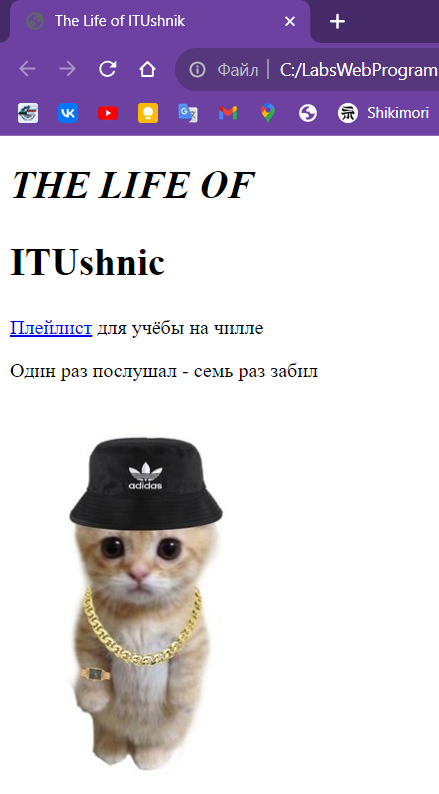

# Отчет по лабораторной работе №3 </br>студента АСБ-3-037 Михеенко М. М.

## Код *index.html*:
```
<!DOCTYPE html>
<html lang="ru">
  <head> 
    <meta charset='utf-8'>
    <meta http-equiv='X-UA-Compatible' content='IE=edge'>
    <title>The Life of ITUshnik</title>
    <meta name='viewport' content='width=device-width, initial-scale=1'>
    <link rel='stylesheet' type='text/css' media='screen' href='main.css'>
  </head>
  <body>
    <h1 style="font-size: 31px; text-transform: uppercase; font-style: italic;">THE LIFE OF</h1>
    <h2 style="font-size: 31px;">ITUshnic</h2>
    <p><a href="https://youtu.be/Ww3MNX4OSM0?si=5jbOFwAvkygbpRWE" target = "_blank">Плейлист</a>  для учёбы на чилле</p>
    <p>Один раз послушал - семь раз забил</p>
    
  </body>
</html>
```

### Резултат:


### Вид с неправильной ссылкой на картинку:
