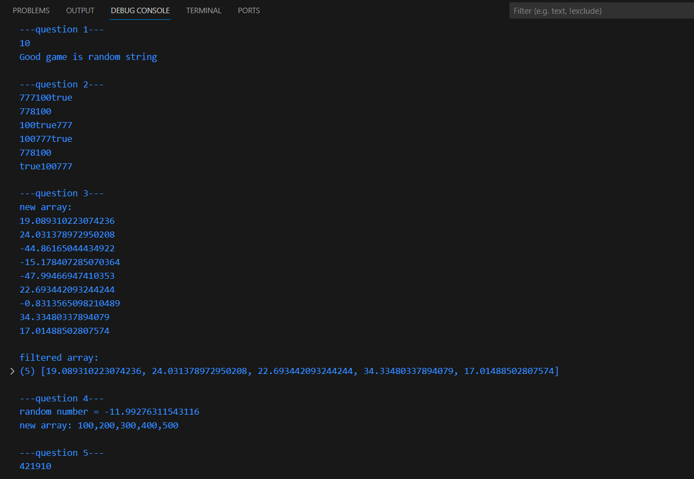
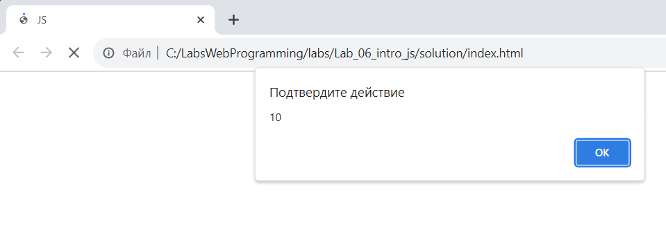
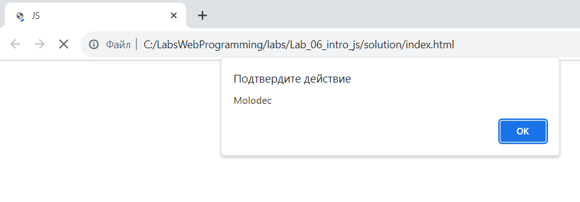
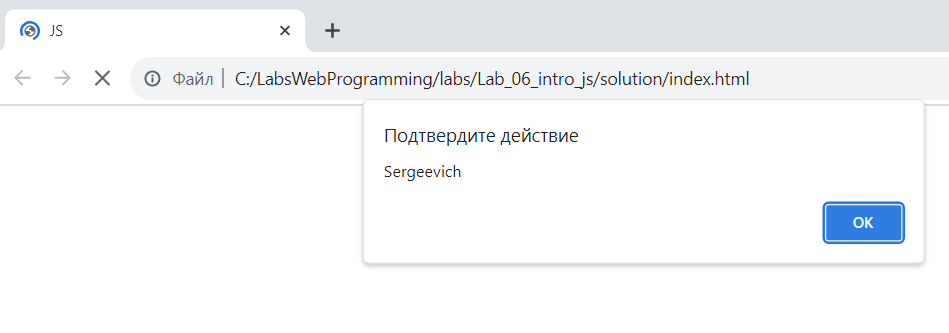
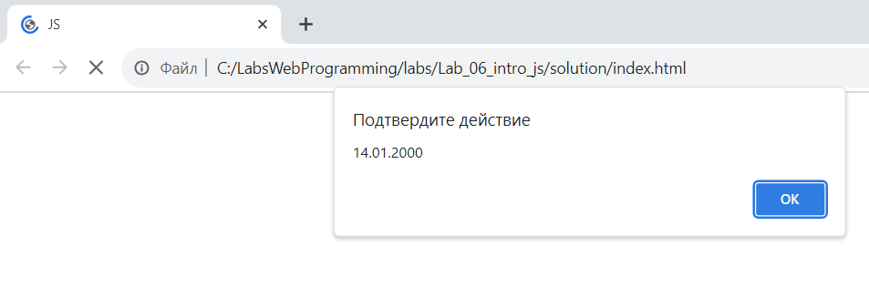
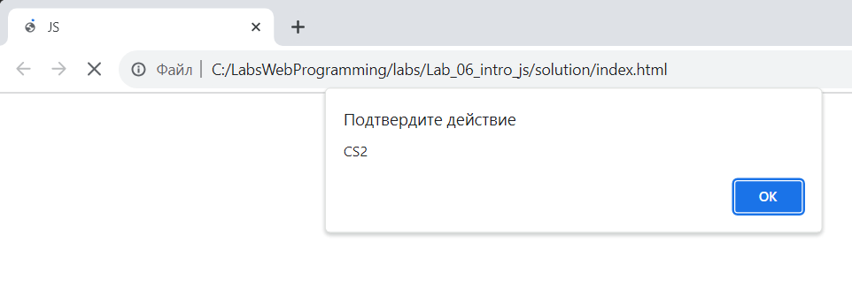

# Отчет по лабораторной работе №6 <br>студента АСБ-3-037 Михеенко М. М.

---
### Код index.html:
```
<!DOCTYPE html>
<html lang="ru">
<head>
    <meta charset="UTF-8"/>
    <meta name="viewport" content="width=device-width, initial-scale=1.0"/>
    <title>JS</title>
</head>
<body>
<script>
    /*Задание 1. Работа с переменными
Нужно создать переменную apple со значением 10
Вывести эту переменную с помощью операторов: alert(); console.log();
Создать переменную condition, значение должно быть случайной строкой
Посмотреть, что будет при выполнении операции console.log('Good game is ' + condition)*/
    console.log("---question 1---")
    var apple = 10
    alert(apple)
    console.log(apple)
    var condition = "random string"
    console.log('Good game is ' + condition)

    /*Задание 2. Магия конкатенации
Создать произвольную целочисленную переменную
Создать строковую переменную, которая будет со значением '100'
Создать произвольную булевую переменную
После этого сделать конкатенацию всех этих переменных, вывести в консоль каждую
Например: console.log(someText + someInt) таких комбинаций должно получиться 6 шт*/
    console.log("\n---question 2---")
    var number = 777
    var str = "100"
    var boolean = true;
    console.log(number+str+boolean)
    console.log(number+boolean+str)
    console.log(str+boolean+number)
    console.log(str+number+boolean)
    console.log(boolean+number+str)
    console.log(boolean+str+number)

    /*Задание 3. работа с массивами
Создать массив длинной 10 элементов
Заполнить этот массив рандомными числами с помощью оператора for
Используя метод filter убрать из массива числа меньше 0*/
    console.log("\n---question 3---")
    let array = []
    console.log("new array:")
    for (let i = 1; i<10; i++){
        array[i] = Math.random()*100-50
        console.log(array[i])
    }
    console.log("\nfiltered array:")
    let positiveArray = array.filter(elem => {
	return elem >= 0;
});
console.log(positiveArray);

/*Задание 4. Работа с функциями
Создать функцию, которая будет возвращать случайное число. Проверить работу функции и вывести в консоль
Создать функцию, которая будет принимать массив в качестве первого параметра, а в качестве второго параметра число. Результатом функции будет массив полученный в результате умножения второго параметра на каждый элемент массива, полученного в качестве первого параметра
Создать анонимную функцию которая будет генерировать случайное слово, вывести в консоль сгенерированное слово*/
console.log("\n---question 4---")
function getRandomNumber() {
  return (Math.random() * 100 - 50);
}
console.log("random number = " + getRandomNumber()); // выводит случайное число от 0 до 99 в консоль

function arrMultipie(arr, x) {
    let mass = [1, 2, 3, 4, 5]
    let someNumber = 100
    for (let i = 0; i <mass.length; i++){
        mass[i]*= someNumber
    }
    return (mass)
}
console.log("new array: "+arrMultipie())


/*Задание 5. Работа с объектами
Создать простой пустой объект
Добавить поля: firstName, surname, patronymic, birthday, hobby и group
Добавить метод, который будет возвращать ФИО, год рождения, хобби и возраст
Вызвать этот метод и вывести результат через alert
Создать объект, где будут храниться зарплаты 10 сотрудников по правилу: ключ - фамилия, а значение - зарплата
После этого необходимо посчитать общую зарплату сотрудников*/
console.log("\n---question 5---")
let myFirstObject = {
    firstName: "Ivan",
    surname: "Molodec",
    patronomic: "Sergeevich",
    birthday: "14.01.2000",
    hobby: "CS2",
    group: "first group"
}
alert(myFirstObject.firstName)
alert(myFirstObject.surname)
alert(myFirstObject.patronomic)
alert(myFirstObject.birthday)
alert(myFirstObject.hobby)
alert(myFirstObject.group)

let sallaryEmployee = {
    alexandrov: 12000,
    ivanov: 22000,
    fedorov: 15000,
    zhmishenko: 45000,
    abobchenko: 123000,
    meshkov: 45610,
    bobov: 78000,
    chuvakov: 14000,
    antonov: 55000,
    luluka: 12300
}
let sum = 0
for (let key in sallaryEmployee){
    sum+= sallaryEmployee[key]
}
console.log("sum of sallary = " + sum)
</script>
</body>
</html>
```

---
### Информация в консоли:


---
### Функции *alert()* выводятся так:






